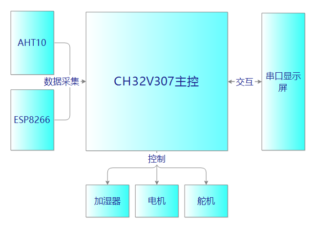

# RT-Thread 视频大纲模板-智能风扇

## 1、项目介绍
本节视频主要介绍为什么要做这个视频，实现了什么功能，以及项目演示等等。

## 2、前期准备
材料等。AHT10，电机，舵机，8266，串口屏，加湿器等等。

## 3、单个模块介绍

### 3.1、AHT10介绍和使用
#### 3.1.1、底层i2c通信协议简介
#### 3.1.2、sensor框架的使用
#### 3.1.3、将AHT10对接到sensor框架

### 3.2、ESP8266介绍和使用
#### 3.2.1、底层usart简介
#### 3.2.2、MQTT通信协议介绍
#### 3.2.3、AT组件使用
#### 3.2.4、实时时间如何获取

### 3.3、串口屏的介绍和使用
#### 3.3.1、串口屏介绍
#### 3.3.2、ui设计

### 3.4、控制模块介绍和使用
#### 3.4.1、底层PWM和PIN框架介绍
#### 3.4.2、如何控制电机，舵机，加湿器

## 4、整体代码框架
### 4.1、如何为多个任务分配线程
### 4.2、如何实现线程间的交互（ipc）
### 4.3、代码整合（逻辑实现）

## 5.完结撒花
